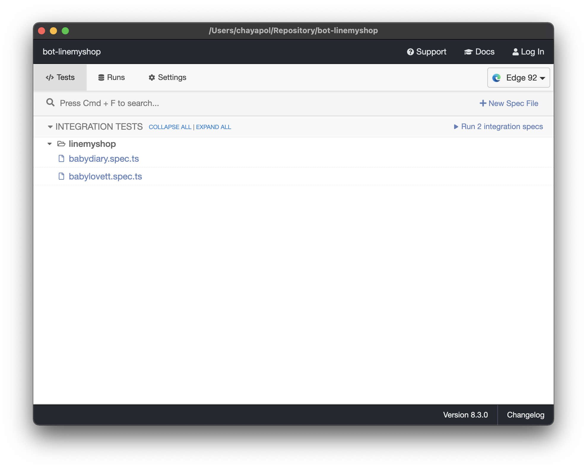

# Line Myshop Bot

## Setup
1. Install Node JS
2. Open this program folder in command line and `npm install`

## Run
### With GUI
   - `npm run cypress` to run GUI
    

### With Command Line
   - `npm run babylovett` to run babylovett script
   - `npm run babydiary` to run babydiary script

## Config
Go to `cypress/integration/linemyshop` folder. it has 2 files
according to scripts.

Each file has configuration variable as follow:

```typescript
// list: list of items with size
const list = [
    ["Rock Star 17 - Top and Shorts", "3T"],
    ["Rock Star 21 - Tank Top and Shorts", "3T"],
    ["Rock Star 20 - Romper", "18-24M"],
    ["Rock Star 19 - Romper", "18-24M"]
]

// url: Line MyShop URL
const url = "https://shop.line.me/@babylovett"

// shopName: Shop Name in Title
const shopName = "Baby Lovett"

// recipient: Recipient name saved in Line MyShop
const recipient = "พัชร เลิศอุดมธนา"

// Time to proceed 
const hours = 14
const minutes = 0
```